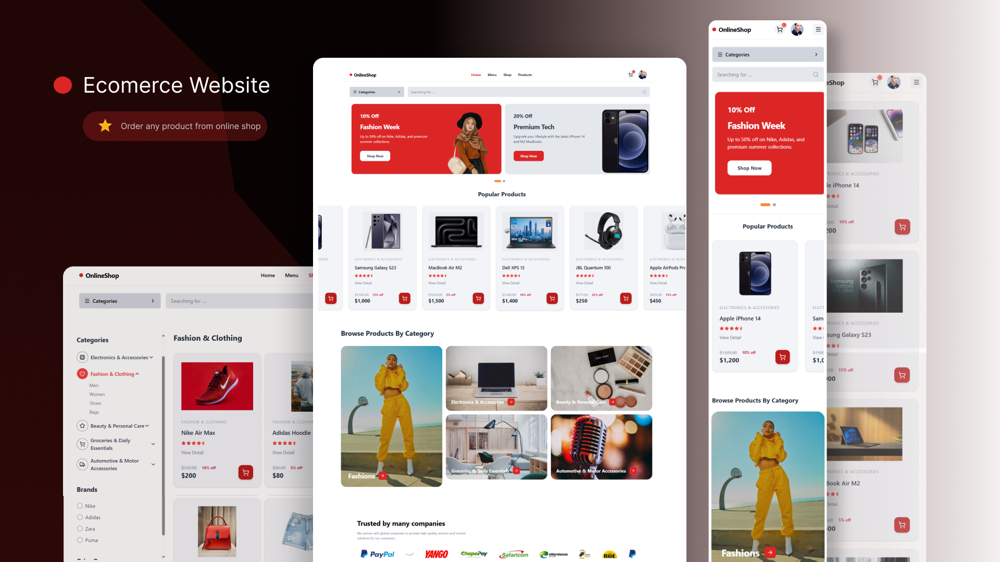

# E-commerce Website

A modern **E-commerce platform** where users can browse products by category, add items to the cart, and securely place orders online.

### Live Preview
Check the live website:  
[View Live Website](https://onlineshop-phi-nine.vercel.app/)

---

## Project Overview

This E-commerce Website allows users to **easily browse products**, manage a shopping cart, and view order history.  
The project focuses on **responsive design**, clean UI, and smooth interactions to provide an enjoyable online shopping experience.  

It demonstrates skills in **frontend development, component-based architecture, and responsive UI/UX design**.

---

## Features

- Browse products with categories, filters, and search  
- Add, remove, and update items in the shopping cart  
- Responsive design for mobile and desktop devices  
- View order history and order details  

---

## Technologies Used

- React.js  
- Tailwind CSS  

---

## Purpose of the Project

This project was built to:  

- Showcase frontend development skills using React and Tailwind CSS  
- Practice building responsive and user-friendly e-commerce interfaces  
- Demonstrate component-based architecture for scalable frontend projects  
- Create a portfolio-ready production-level web application  

---

